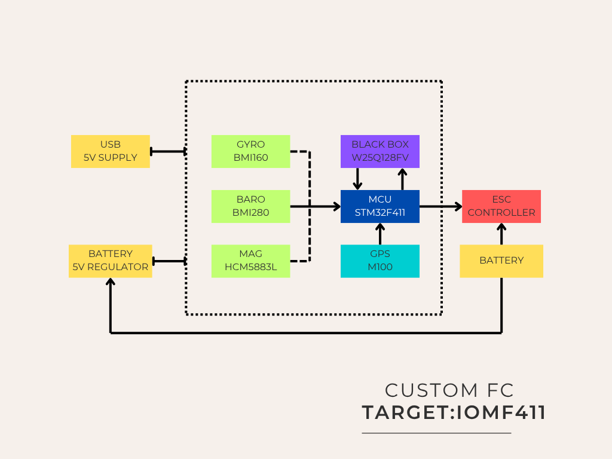

# Xfly - The Custom Flight Controller Board

## Introduction

Welcome to my  XFly Flight Controller Board project! I have designed and built my own flight controller hardware from the ground up, tailored specifically for Betaflight to deliver exceptional performance for FPV drones. This repository provides a custom Betaflight target for my unique hardware, enabling seamless integration with the open-source Betaflight firmware. Designed for enthusiasts and professionals, this flight controller supports STM32-based processors (e.g., F4, F7, or H7) and includes optimized configurations for peripherals like ESCs, receivers, GPS, and OSD, making it ideal for multi-rotor and fixed-wing crafts.

Below is a diagram illustrating the hardware connections for my custom flight controller. This serves as a reference for setting up the board.




## Testing Results and Sensor Test Guidelines

To validate the performance of our custom flight controller and firmware, we conducted initial tests using an STM32 development board paired with sensor modules in a controlled indoor environment. These tests aimed to reduce costs while evaluating the hardware and firmware setup. **Important**: The sensor modules used (gyroscope, accelerometer, magnetometer, and barometer) are for initial testing only and are not suitable for final drone builds. Some modules may be duplicate variants, which could compromise reliability. For safety and optimal performance in production drones, we strongly recommend using original sensors purchased from authorized dealers. The use of cost-effective modules during testing allowed us to assess baseline performance in a closed environment, with the expectation that original sensors will yield significantly better results.

Below is an image of our test setup, showing the STM32 development board and connected sensor modules.


### Testing Methods

Accurate real-time measurements of yaw, pitch, and roll angles are critical for precise drone control. To achieve this, we tested the gyroscope, accelerometer, magnetometer, and barometer individually to ensure their reliability with our custom flight controller.

- **Gyroscope and Accelerometer Testing**:
  We tested the gyroscope and accelerometer by rotating the flight controller to known roll and pitch angles, measured using high-precision digital angle meters. The maximum error observed was 0.2 degrees, confirming high accuracy in detecting angular changes.

- **Magnetometer Testing**:
  The magnetometer measures yaw as a deviation from magnetic north. We validated its performance by comparing readings against a professional digital compass. The maximum deviation error was 2 degrees, indicating reliable yaw measurements suitable for flight control.

- **Barometer Testing**:
  Barometer readings were evaluated using a meter scale to verify altitude measurements. Despite some noise due to indoor ventilation, the barometer provided near-accurate readings, sufficient for initial testing in a controlled environment.

These results demonstrate that our custom flight controller, even with cost-effective test modules, achieves excellent sensor performance. Using original sensors from authorized dealers will further enhance reliability and accuracy in real-world flight conditions.

## Prerequisites

Before setting up the flight controller, ensure you have the following:
- A custom flight controller board based on an STM32 processor (e.g., F4).
- A USB data cable (not charging-only) for connecting the flight controller to your computer.
- A computer running Windows, macOS, or Linux.
- Basic soldering tools and skills for connecting peripherals.
- A compatible receiver, ESCs, and other peripherals as per your drone's requirements.

## Setup Instructions

### 1. Connect Devices as Shown in the Diagram

**Important**:
- Double-check connections to avoid incorrect wiring (e.g., TX-to-TX or RX-to-RX will not work).
- Ensure the flight controller is mounted in the correct orientation (check Board Alignment in Betaflight Configurator if needed).
- Remove propellers during configuration to prevent accidents.

### 2. Install Betaflight Configurator 11

Betaflight Configurator is the cross-platform tool used to configure and flash your flight controller. Follow these steps to install version 11:

1. **Download Betaflight Configurator**:
   - Visit the official Betaflight Configurator GitHub releases page: [https://github.com/betaflight/betaflight-configurator/releases](https://github.com/betaflight/betaflight-configurator/releases).
   - Download the appropriate installer for your operating system:
     - **Windows**: `betaflight-configurator-installer_11.0.0_win64-installer.exe`
     - **macOS**: `betaflight-configurator_11.0.0_macOS.dmg`
     - **Linux**: `betaflight-configurator_11.0.0_amd64.deb` (for Debian/Ubuntu) or `betaflight-configurator_11.0.0_linux64-portable.zip` (for other distributions).

2. **Install the Configurator**:
   - **Windows**: Run the installer and follow the prompts. Install the necessary drivers (e.g., Zadig for DFU mode) if prompted.
   - **macOS**: Open the `.dmg` file and drag the application to your Applications folder.
   - **Linux**: For Debian/Ubuntu, install the `.deb` file using:
     ```bash
     sudo dpkg -i betaflight-configurator_11.0.0_amd64.deb
     sudo apt-get -f install
     ```
     Ensure the `libatomic` library is installed:
     ```bash
     sudo apt-get install libatomic1
     ```
     Add your user to the `dialout` group for serial port access:
     ```bash
     sudo usermod -a -G dialout $USER
     ```
     Log out and back in to apply changes.

3. **Launch Betaflight Configurator**:
   - Open the application. Ensure your system language is detected, or select your preferred language (supports 21 languages, including English, Español, 日本語, etc.).

### 3. Load the Firmware

Follow these steps to flash your custom Betaflight target firmware onto the flight controller:

1. **Flash the Firmware**:
   - Using Flash Firmware(local) load our custom Firmware.


2. **Apply Custom Defaults**:
   - After flashing, reconnect to the flight controller.
   - When prompted, select **Yes** to apply custom defaults specific to your target.


## Acknowledgments

- **Betaflight Team**: For providing the open-source firmware and Configurator.
- **Community Contributors**: For continuous support and feedback.
- **You**: For building and using this custom flight controller target!

Happy flying! 🚀
